<html>
  <head>
    <!--Links for Fonts -->
    <link
      href="https://fonts.googleapis.com/css2?family=Comfortaa:wght@400;500&display=swap"
      rel="stylesheet"
    />
    <link
      href="https://fonts.googleapis.com/css2?family=PT+Sans&display=swap"
      rel="stylesheet"
    />
  </head>
  <body>
        <h1>Traveling the World</h1>
        <h2>California, America</h2>
        
 Where better to start than my home state California!

      <h3>California Poppies</h3>
        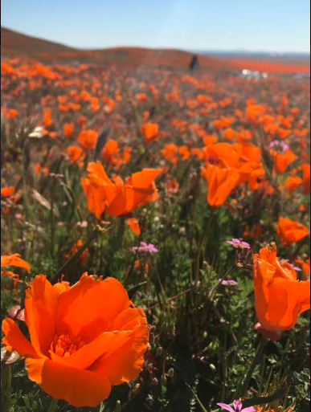
      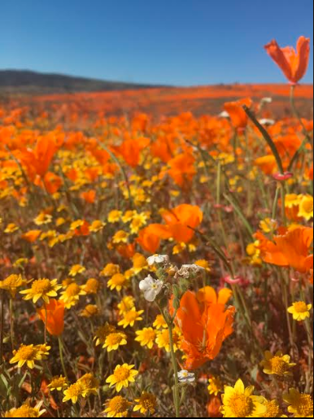
        

          California's beautiful state flowers bloom every spring! You can check these
          <a
            href="https://www.tripping.com/guides/places-to-see-california-super-blooms"
            >Poppy Sites</a
          > to make your own plans to spend the day or even an hour in a meadow filled with orange poppies and other wildflowers. These spots have the right scenery for vivid pictures that are sure to not disappoint!
        

    <h3>San Francisco</h3>
        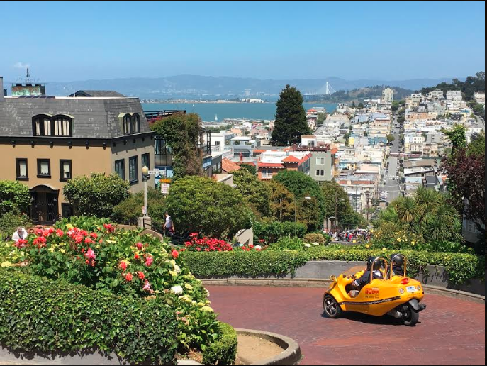
        

          One of the more popular tourist cities is San Francisco. Take a drive through Lombard Street, the street may be crowded, but there's a beautiful sight and many fun turns.        

        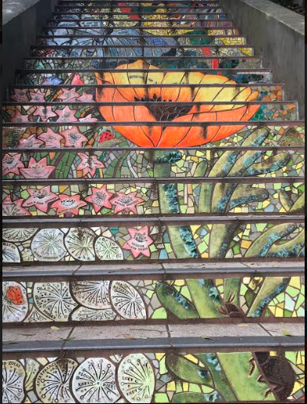
    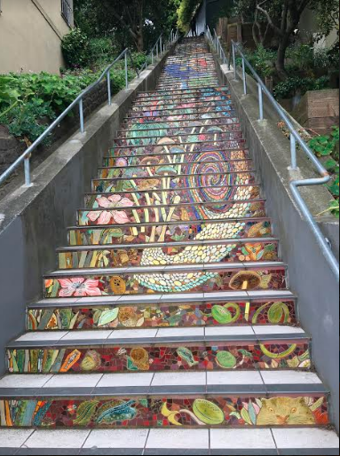
        

          Want to take a break from the iconic Lombard Street or Golden Gate Bridge? Enjoy art? Then you should definitely walk on the 16th Avenue tiled staircase! These are beautiful mosaics that piece together a lovely image.          
        

    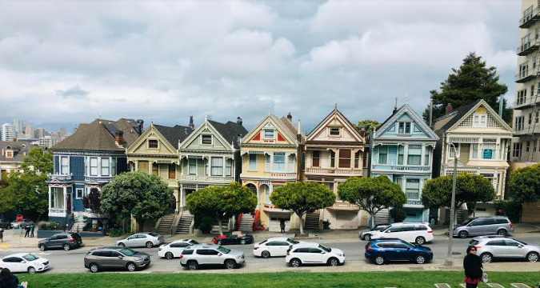
    
Another interesting place to check out are the Painted Ladies, which were named so because of the different colors that each house was painted. These houses make for an unusual sight, but a splendid photo. You can also rest on the hills opposite of these houses and just enjoy the view. 

    <h2> Alberta, Canada </h2>
    <h3>Bow River</h3>
    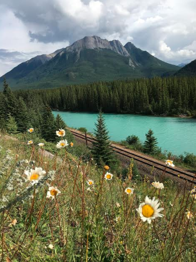
    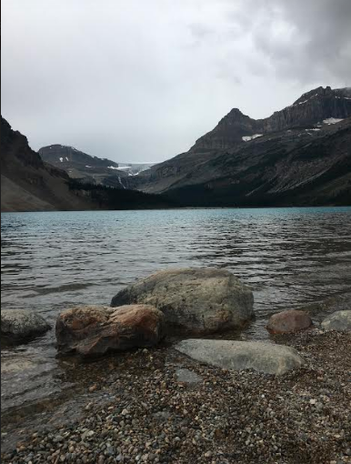
    
Canada has many scenic places, one of them being Bow River. Bow River has a cerulean hue, adding to the other natural features of the area. There's also a lake at which the river winds into. Stop by, take a rest, and enjoy the view!

    <h3> Lake Louise</h3>
    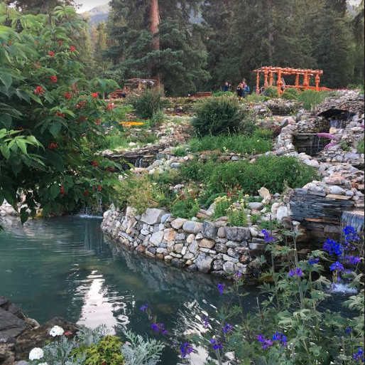
    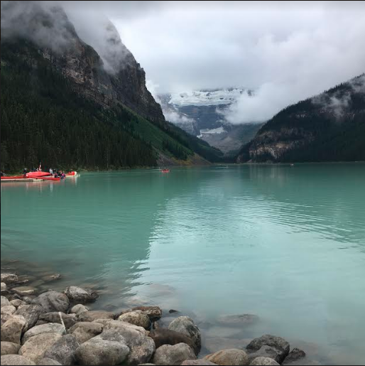
    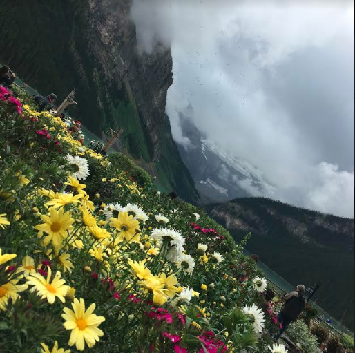
    
 Another popular site is Lake Louise. Here, you can enjoy the vibrant gardens in front of the lake as well as enjoy the exquisite Fairmont Château hotel. Aside from just taking in the beauty, you could also kayak on the lake or even take a hike.

    <h3>Peyto Lake</h3>
    
    
This view requires some exertion as you have hike uphill. Click <a href="https://www.todocanada.ca/city/banff/listing/peyto-lake-banff-national-park/#:~:text=Peyto%20lake%20is%20located%20on,paved%20path%20to%20the%20lookout.">here</a> for more information regarding visits to Peyto Lake.

